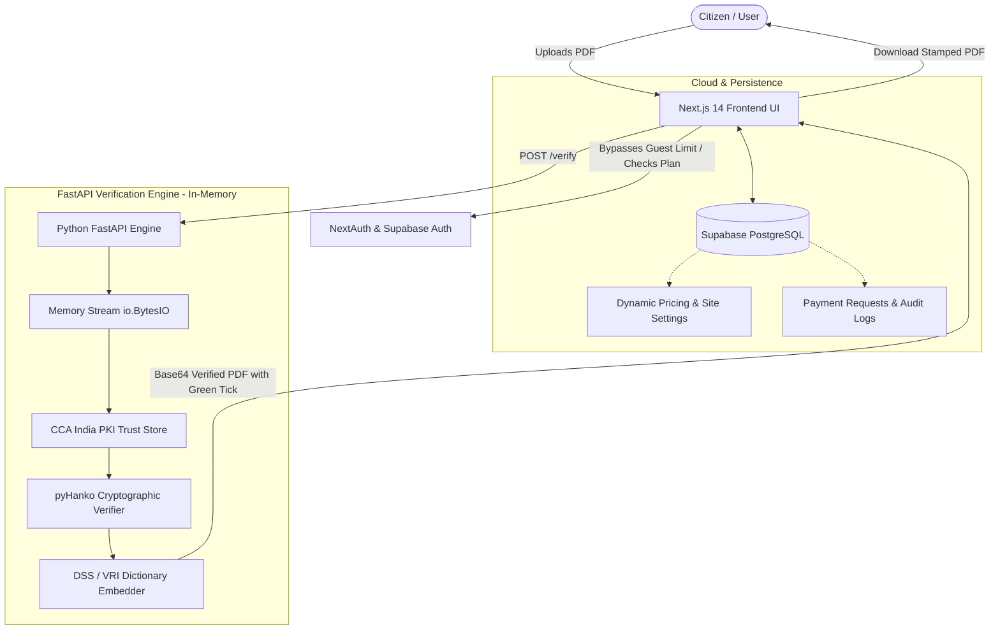

<div align="center">

# 🛡️ VeriSeal (சரிபார்)
### Official Indian Government PDF Digital Signature Verification & LTV Stamping Platform

[](https://nextjs.org/)
[](https://fastapi.tiangolo.com/)
[](https://python.org)
[](https://www.typescriptlang.org/)
[](https://tailwindcss.com/)
[](https://supabase.com/)
[](https://www.docker.com/)
[](LICENSE)

**Instant verification of digital signatures on Indian Government e-certificates with permanent LTV green-tick embedding. 100% In-Memory & Privacy-Guaranteed.**

[Live Demo](https://veriseal.in) • [API Documentation](#-api-endpoints) • [Quickstart](#-quick-start) • [Deployment](#-production-deployment)

</div>

---

## 🇮🇳 Overview

In India, millions of citizens receive digitally signed government PDFs (e-Aadhaar, Community certificates, Income certificates, e-PAN cards, DigiLocker records) displaying an alarming **yellow question mark (`?`)** instead of a verified green tick (`✓`).

**VeriSeal** resolves this nationwide challenge:
1. Cryptographically validates digital signatures against the **official Controller of Certifying Authorities (CCA India) PKI Root Trust Stores**.
2. Embeds standard Adobe Acrobat **LTV (Long-Term Validation) DSS structures** so the document retains a permanent green checkmark in Adobe Acrobat Reader and all standard PDF viewers.
3. Operates on a **100% Zero-Storage Privacy Architecture** — documents and passwords are processed entirely in ephemeral RAM (`io.BytesIO`) and never written to disk.

---

## ✨ Key Features

- **🏛️ CCA India Root & Sub-CA Validation**: Preloaded with root certificates for RCAI 2004/2014/2022 and licensed sub-CAs (NIC, eMudhra, Capricorn, (n)Code, SafeScrypt/Sify, Protean/NSDL).
- **🔒 Zero-Storage Privacy**: Files are decrypted and validated purely in memory streams. Zero disk writes, zero database document copies.
- **🌐 Real-Time Bilingual UI**: Complete English and Tamil (`தமிழ்`) support with live dynamic translation toggle across all pages.
- **📄 Password-Protected PDF Handling**: Native memory decryption for e-Aadhaar and e-PAN convention passwords.
- **⚡ Permanent LTV Green-Tick Stamping**: Injects RFC 3161 timestamps, CRLs, and OCSP revocation responses into `/DSS` dictionaries.
- **👑 Full Administration Panel**: Real-time management of user subscriptions, UPI payment approval desk, and live dynamic site settings.
- **💳 Dynamic UPI Payment Gateway**: Seamless QR code and manual UTR transaction verification flow with real-time price synchronization from admin settings.
- **📱 PWA & Offline Support**: Mobile-first responsive interface installable as a Progressive Web App (PWA).

---

## 🏛️ Supported Document Formats

| Document Authority | Typical Certificate Types | Password Format | Detection |
| :--- | :--- | :--- | :---: |
| **UIDAI** | e-Aadhaar, Masked Aadhaar | `NAME1995` (First 4 letters + Birth Year) | ✅ Auto |
| **Income Tax Dept / NSDL / UTIITSL** | e-PAN Card | `DDMMYYYY` (Date of Birth) | ✅ Auto |
| **TN e-Sevai / Revenue Dept** | Community, Nativity, Income, First Graduate, OBC | None | ✅ Auto |
| **DigiLocker / MoRTH** | Driving License, Vehicle RC, Marksheets | None | ✅ Auto |
| **Income Tax Dept** | ITR-V Acknowledgement Form | `PAN + DOB` | ✅ Auto |
| **Municipal Corporations** | Birth & Death Certificates | None | ✅ Auto |

---

## 🏗️ System Architecture



---

## 🚀 Quick Start

### Prerequisites
- **Node.js**: `v18.17+` (v20+ recommended)
- **Python**: `3.10` or `3.11`
- **Docker** *(Optional, for containerized deployment)*

### 1. Clone the Repository
```bash
git clone https://github.com/Arulraj2001/Veri-Seal.git
cd Veri-Seal
```

### 2. Configure Environment Variables
Copy the template and fill in your Supabase credentials:
```bash
cp .env.example .env.local
```

Key variables to review:
```env
NEXT_PUBLIC_API_URL=http://127.0.0.1:7860
NEXT_PUBLIC_SUPABASE_URL=https://your-project.supabase.co
NEXT_PUBLIC_SUPABASE_ANON_KEY=your-anon-key
SUPABASE_SERVICE_ROLE_KEY=your-service-role-key
AUTH_SECRET=your_32_character_auth_secret
ADMIN_EMAIL=admin@veriseal.in
```

### 3. Start Python Verification Backend
```bash
# Create virtual environment
python -m venv venv
source venv/bin/activate  # On Windows: venv\Scripts\activate

# Install dependencies
pip install -r requirements.txt

# Start FastAPI server (Port 7860)
uvicorn app:app --host 127.0.0.1 --port 7860 --reload
```
Test health status: `http://127.0.0.1:7860/health` $\rightarrow$ `{"status": "ok"}`

### 4. Start Next.js Frontend
```bash
# Install NPM packages
npm install

# Start Next.js dev server (Port 3000)
npm run dev
```
Open [http://localhost:3000](http://localhost:3000) in your browser.

---

## 📡 API Endpoints

### 1. Single PDF Verification
```http
POST /verify
Content-Type: multipart/form-data
```
| Parameter | Type | Required | Description |
| :--- | :--- | :---: | :--- |
| `file` | Binary | **Yes** | PDF file to verify (Max 25 MB) |
| `password` | String | Optional | Decryption password for password-protected PDFs |

#### Sample Response (`200 OK`)
```json
{
  "status": "VALID",
  "document_type": "e-Aadhaar (UIDAI)",
  "signatures": [
    {
      "field_name": "Signature1",
      "signer_name": "Unique Identification Authority of India",
      "signer_org": "UIDAI",
      "issuer": "NIC CA 2014 Sub-CA",
      "valid_from": "2021-04-12T08:30:00",
      "valid_to": "2024-04-12T08:30:00",
      "signed_on": "2023-11-20T14:15:32",
      "covers_whole_document": true,
      "hash_valid": true,
      "chain_valid": true,
      "ltv_added": true
    }
  ],
  "verified_pdf_base64": "JVBERi0xLjc..."
}
```

### 2. Service Health Check
```http
GET /health
```
Returns `{ "status": "ok", "version": "1.0.0" }`.

### 3. Supported Document Patterns
```http
GET /supported-docs
```

---

## 🌐 Production Deployment

### Backend (Render or Docker Host)
1. In [render.com](https://render.com), select **New Web Service** and link this repository.
2. Select **Docker** environment (or Python 3.11 with `pip install -r requirements.txt`).
3. Set Port to `7860`.
4. Add a free 10-minute HTTP ping on [UptimeRobot](https://uptimerobot.com) to `https://your-backend.onrender.com/health` to keep the free instance active 24/7 without cold-starts.

### Frontend (Vercel)
1. Import `Arulraj2001/Veri-Seal` into [vercel.com](https://vercel.com).
2. Set Environment Variables (`NEXT_PUBLIC_API_URL`, `NEXT_PUBLIC_SUPABASE_URL`, `NEXT_PUBLIC_SUPABASE_ANON_KEY`, `AUTH_SECRET`, `ADMIN_EMAIL`).
3. Click **Deploy**.

---

## 🧪 Automated Testing

Run the comprehensive cryptographic verification test suite:
```bash
python -m unittest discover -s tests
```
Validates certificate trust stores, LTV embedding, wrong-password handling, and rate limits.

---

## 🔐 Security & Privacy Commitments

1. **Zero Data Retention**: Uploaded PDF buffers exist only during cryptographic evaluation in RAM and are dereferenced immediately.
2. **Encrypted Passwords**: Document passwords are used in-memory for decrypting cipher streams and are never persisted or logged.
3. **CCA PKI Integrity**: Signature validation is anchored to official government trust certificates without external third-party telemetry.

---

## 📄 License

Distributed under the **MIT License**. See `LICENSE` for more information.

<div align="center">
  <sub>Built with ❤️ for Indian Citizens, Advocates, CAs & CSC Centers</sub>
</div>
